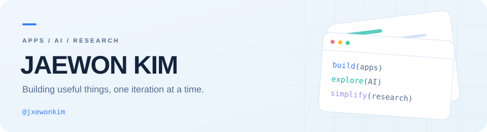
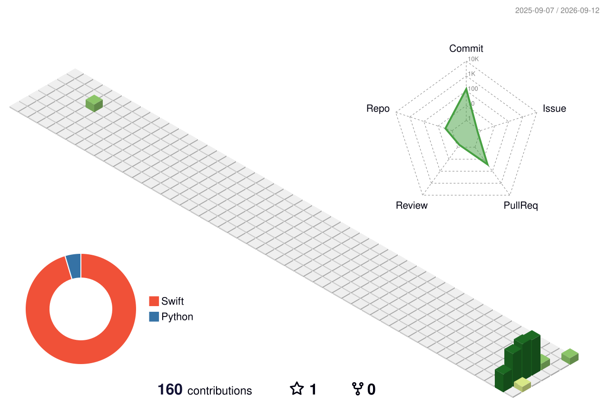

<picture>
  <source media="(prefers-color-scheme: dark)" srcset="./assets/header-dark.svg">
  
</picture>

  <b>아이디어를 앱으로, 반복 작업을 도구로.</b> 
  AI를 활용한 앱 개발과 연구 도구를 만들고 있습니다.

  
  

 

### 👋 About me

- **macOS 앱** — 개발 과정에서 직접 겪는 불편을 해결하는 도구를 만듭니다.
- **AI & 연구 도구** — 논문을 읽고 정리하는 과정을 돕는 앱을 실험합니다.
- **만드는 방식** — 작은 기능부터 구현하고, 테스트와 실제 사용을 통해 다듬습니다.

 

### 🛠 Tools I use

  
  
  
  
  
  

 

### 🚀 Selected projects

| Project | What I'm building |
| :--- | :--- |
| **[DevSift](https://github.com/jxewonkim/devsift)** Swift · SwiftUI · macOS | 개발자와 AI 빌더를 위한 로컬 저장 공간 분석 도구. 파일의 역할과 정리 판단 근거를 설명하는 앱을 개발하고 있습니다. |
| **[SciJerry Literature Reviewer LITE](https://github.com/jxewonkim/SciJerry-Literature-Reviewer-LITE-)** Python · Flask · Gemini | PDF 논문을 업로드해 종합 분석, 연구 방법론 검토, STROBE 체크리스트 기반 정리를 돕는 연구 보조 도구입니다. |

  
<b>조금 더 자세히 보기</b>

 

**DevSift** 
파일의 크기뿐 아니라 개발 캐시의 구조와 프로젝트 맥락을 살펴보는 macOS 도구를 만들고 있습니다. 로컬 처리와 설명 가능한 판단, 사용자가 확인하는 정리 과정을 중요하게 생각합니다. 현재 개발 중인 프로젝트입니다.

**SciJerry** 
PDF에서 추출한 논문 텍스트를 바탕으로 AI 분석 결과를 한국어와 영어로 제공합니다. 논문 내용을 살펴보는 보조 도구이며, 결과는 원문과 함께 확인하도록 사용합니다.

 

### 🌱 Contribution landscape

<picture>
  <source media="(prefers-color-scheme: dark)" srcset="./profile-3d-contrib/profile-night-rainbow.svg">
  
</picture>

GitHub 활동을 매일 자동으로 갱신합니다.

  

Build something useful. Keep making it better.

